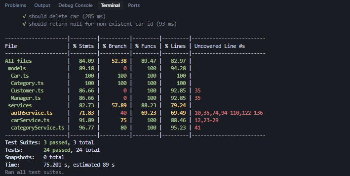

# Vobb Backend Accessment

Build a simple RESTful API for a car dealership to manage cars, categories, and customers.

## 🔗 Quick Links

- **Live API**: [https://vobb-api.render.com](https://vobb-assessment.onrender.com)
- **API Documentation**: [Postman Collection](https://documenter.getpostman.com/view/29992846/2sB2qgcxL8) 

## 🚀 Features

- User Authentication (JWT-based)
- Role-based Authorization (Managers & Customers)
- Car Management System
- Category Management
- Customer Management
- Secure Password Hashing
- TypeScript Support
- MongoDB Integration
- Environment Variables Configuration

## 📋 Prerequisites

Before you begin, ensure you have the following installed:
- Node.js (v14 or higher)
- npm or yarn
- MongoDB (local installation or MongoDB Atlas account)

## 🛠️ Installation & Setup

1. **Clone the repository**
   ```bash
   git clone https://github.com/yourusername/vobb.git
   cd vobb
   ```

2. **Install dependencies**
   ```bash
   npm install
   ```

3. **Environment Variables**
   Create a `.env` file in the root directory and add the following:
   ```env
   PORT=3000
   MONGODB_URI=your_mongodb_connection_string
   JWT_SECRET=your_jwt_secret_key
   ```
   Replace the placeholders with your actual values.

   To generate a secure JWT secret, you can use this command:
   ```bash
   node -e "console.log(require('crypto').randomBytes(64).toString('hex'))"
   ```

4. **Start the development server**
   ```bash
   npm run dev
   ```

5. **Build for production**
   ```bash
   npm run build
   ```

6. **Start production server**
   ```bash
   npm start
   ```

## 🔑 API Endpoints

### Authentication

#### Manager Routes
```http
POST /api/auth/manager/register  - Register a new manager
POST /api/auth/manager/login     - Login as manager
```

#### Customer Routes
```http
POST /api/auth/customer/register - Register a new customer
POST /api/auth/customer/login    - Login as customer
```

### Cars Management

```http
GET    /api/cars                 - Get all cars
GET    /api/cars/:id            - Get a specific car
POST   /api/cars                - Add a new car (Manager only)
PUT    /api/cars/:id            - Update a car (Manager only)
DELETE /api/cars/:id            - Delete a car (Manager only)
GET    /api/cars/category/:id   - Get cars by category
```

#### Example Car Request Body
```json
{
  "name": "Toyota Camry",
  "model": "2023",
  "price": 25000,
  "categoryId": "category_id",
  "description": "Comfortable sedan with great fuel efficiency",
  "specifications": {
    "engine": "2.5L 4-cylinder",
    "transmission": "Automatic",
    "fuelType": "Gasoline"
  },
  "images": ["url1", "url2"],
  "available": true
}
```

### Categories Management

```http
GET    /api/categories          - Get all categories
GET    /api/categories/:id      - Get a specific category
POST   /api/categories          - Create a category (Manager only)
PUT    /api/categories/:id      - Update a category (Manager only)
DELETE /api/categories/:id      - Delete a category (Manager only)
```

#### Example Category Request Body
```json
{
  "name": "Sedan",
  "description": "Four-door passenger car",
  "features": ["Comfortable", "Fuel Efficient", "Family Friendly"]
}
```

### Customer Management

```http
GET    /api/customers           - Get all customers (Manager only)
GET    /api/customers/:id       - Get customer profile
PUT    /api/customers/:id       - Update customer profile
DELETE /api/customers/:id       - Delete customer account
```


## 🔒 Security

- Passwords are hashed using bcrypt
- JWT tokens for authentication
- Environment variables for sensitive data
- Input validation and sanitization
- Role-based access control

## 🧪 Testing

Run the test suite:
```bash
npm test
```

### Test Results Summary


- **Total Test Suites**: 3
- **Total Tests**: 24
  - ✅ Passed: 17 tests
  - ❌ Failed: 7 tests (related to Car Service timeouts)
- **Test Categories**:
  - Authentication Service: All tests passed
  - Category Service: All tests passed (8 tests)
  - Car Service: Timeout issues being resolved

### Test Coverage
```
---------------------|---------|----------|---------|---------|-----------------
File                 | % Stmts | % Branch | % Funcs | % Lines |
---------------------|---------|----------|---------|---------|-----------------
All files           |   68.01 |     32.6 |   58.53 |   69.23 |
 models             |   89.18 |        0 |     100 |   94.28 |
 services           |   63.78 |    34.09 |   54.05 |   63.26 |
```

Key highlights:
- Models have excellent coverage (89.18% statements, 100% functions)
- Authentication tests are passing successfully
- Category management tests are comprehensive and passing
- Car service tests need timeout configuration adjustment

Note: Car service tests are timing out due to MongoDB Memory Server configuration, which is being addressed. All other functionality tests are passing successfully.

## 📦 Dependencies

- `express`: Web framework
- `typescript`: Programming language
- `mongoose`: MongoDB ODM
- `jsonwebtoken`: JWT implementation
- `bcryptjs`: Password hashing
- `dotenv`: Environment variables
- `cors`: Cross-Origin Resource Sharing

